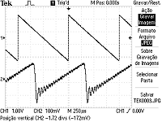
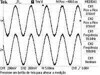
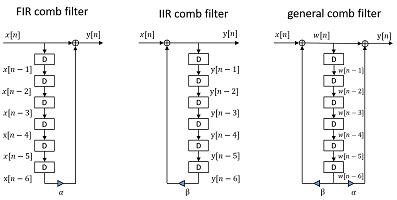
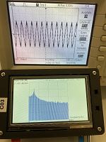
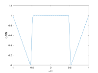
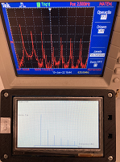
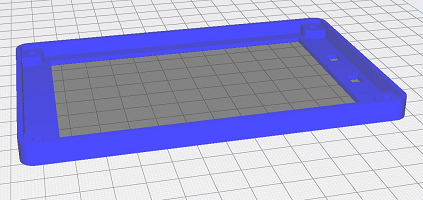
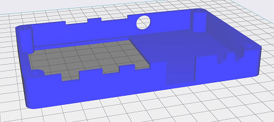
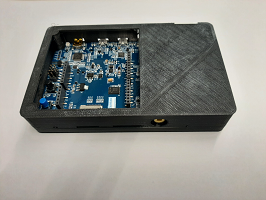

# U.Porto-version-of-DSP-Education-Kit

This is an adaptation of the original [ARM University DSP Education Kit](https://github.com/arm-university/Digital-Signal-Processing-Education-Kit) to serve the specificities of an undergraduate signal processing course at the University of Porto - Faculty of Engineering. Our course (called Fundamentals of Signal Processing) had its first edition in 2021/2022, and is structured as a combination of three types of classes: lectures (1.5 h/week), applied theory (1.5 h/week), and labs (1 h/week). Although this arrangement may change in the near future, the [current course syllabus](https://sigarra.up.pt/feup/en/UCURR_GERAL.FICHA_UC_VIEW?pv_ocorrencia_id=485397) and the rather short duration of lab classes recommend an adapted version of the original ARM lab materials so that students can address in the lab a few key experiments and associated questions whcih are subject to grading.  
We describe next what the focus is in each lab and how it relates to the orginal ARM lab materials.
## LAB 01 
**Lab Summary:** Getting started with the DSP Education kit: LUT-based Real-Time Sine Wave Generation), Basic Analogue Input & Output Using the STM32F746G Disco Board, and Delaying the Signal.

This first DSP lab consists of a simplified version of the original ARM “LAB 1 Analog Input and Output” that is included in the original ARM Module_1/Lab/IntroductionLab folder. It assumes that all the installation steps that are specified in the original ARM “DSP_Getting_Started_Guide.docx” have been followed through and successfully completed. In our case, before the start of lab classes, all lab PCs have been configured according to the instructions in the original ARM “DSP_Getting_Started_Guide.docx”. 
## LAB 02 
**Lab Summary:** Getting started with the DSP Education kit: viewing program output.

This lab consists of a continuation of the previous lab. It is based on the section of the original ARM “LAB 1 Analog Input and Output” that is included in the original ARM Module_1/Lab/IntroductionLab folder and that focusses on exporting to Matlab specific memory contents of the STM32F7 Kit. Two signals are generated on the Kit: a deterministic signal (a sinusoid) and a random signal (using a pseudo-random sequence generator). 
## LAB 03
**Lab Summary:** Understanding sampling and reconstruction: understanding that filtering effects depend on the frequency response characteristics of the filter (either analog, or discrete-time), understanding the different components in a complete signal processing chain, understanding basic effects of sampling and reconstruction on sinusoidal, rectangular, triangular, and sawtooth waves.

This lab consists of an adaptation of the previous labs highlighting the complete signal processing chain and that includes both analog and discrete-time filters. Students are motivated to understand that although two filters have the exact same frequency response magnitude, the output wave may look different because of the phase response of the filters, for example if one filter is linear-phase, and the other is minimum-phase. Then, students are also motivated to understand why different waveforms at the input of the STM32F7 Kit appear as pure sinusoids at the output of the Kit for different frequencies.
## LAB 04
**Lab Summary:** Measuring the frequency response of a moving average filter that is implemented and running in real-time on the STM32F746G Discovery board using different (recursive and non-recursive) but equivalent difference equations.

This lab is a simplified and adapted version of the original ARM “LAB 3 -Finite Impulse Response (FIR) Filters” that is included in the original ARM Module_6/Lab/ folder. The lab introduces FIR filtering using as a baseline a moving average filter of length 5, and motivates the experimental assessment of the frequency response of this and other FIR filters running in real-time on the STM32F746G board. 
## LAB 05
**Lab Summary:** Experimental determination of the frequency response of FIR and IIR comb filters running in real-time on the STM32F746G Discovery board.

This lab is a continuation of the previous lab and has been adapted to highlight the different types of comb filters (FIR, IIR, and general) and to emphasize that their theoretical and practical frequency responses are consistent with the Z-domain analysis of those filters. Aspects of special interest are the effects of poles (in terms of peaks in the frequency response magnitude), and the effects of zeros (in terms of valleys in the frequency response magnitude).
## LAB 06
**Lab Summary:** Evaluation of the DMA operation and conclusion on its advantages and differences to interrupt-based transfer of individual samples. Evaluation of the graphical representation capabilities of the STM32F746G board and LCD.

This DSP lab consists of Section 8 of the original ARM “LAB 1 Analog Input and Output” that is included in the original ARM Module_1/Lab/IntroductionLab folder. Its goal is i) to motivate students to understand DMA-based processing as an alternative to interrupt-based individual audio samples transfer, ii) to allow students to have a sense of the low input-output delay (i.e. low latency) of the A/D and D/A operation on the STM32F746G board, and iii) to motivate students to the graphical LCD representation capabilities of the STM32F746G board.
## LAB 07
**Lab Summary:** Experimental determination of the frequency response two 2nd-order IIR filters running in real-time on the STM32F746G Discovery board: an All-Pole filter, and an All-Pass filter. Appreciation of the impact of the group delay of the All-Pass system when the input waveform is a sine wave, or a sawtooth wave.

This lab is a simplified and adapted version of the original ARM “LAB 4 -Infinite Impulse Response (IIR) Filters” that is included in the original ARM Module_8/Lab/ folder. In this lab, a simple experimental method is used to estimate the frequency response magnitude of both all-pole and all-pass filters, and to compare them to the theoretical one. Finally, a simple procedure is followed to assess, in real-time, the impact of the group delay of the second-order all-pass filter, with that of a trivial zeroth-order all-pass system.
## LAB 08
**Lab Summary:** Design, modification and measurement of the frequency response of FIR filters running in real-time on the STM32F746G Discovery board: an equiripple linear-phase FIR of order 80, and two modified versions of the designed FIR filter. Experimental determination of the frequency responses of all three filters and comparison to the theoretical ones.

In this lab, a baseline (and peculiar) linear-phase FIR filter of order 80 is first designed using the Parks-McCellan optimal equiripple FIR filter design package in Matlab. If the transfer function of this baseline filter is represented by H(z), two variations of this baseline filter are created that correspond to H(-z) and to H(z2). Students are motivated to intuitively understand what these modifications correspond to, and are invited to experimentally verify the frequency responses of all three filters and to confirm consistency with theory.
## LAB 09
**Lab Summary:** Theoretical and practical aspects of special FIR filters: linear-phase, minimum-phase and other phase responses of FIR filters. Design, implementation and real-time operation of a discrete-time differentiator, and a Hilbert Transformer.

This lab is an adaptation of the previous lab (lab 8). It revisits the theory of FIR filters, the underlying concepts of Z-plane zero distribution, linear-phase, minimum-phase and other alternative phase responses. The lab also proposes a lab implementation of a discrete-time differentiator, and Hilbert transformer, and motivates a discussion on the practical relevance and interpretation of the corresponding results.
## LAB 10
**Lab Summary:** Design, analysis, implementation and real-time operation of a 6th-order band-stop filter. This includes i) design and decomposition of the 6th-order band-stop filter into second-order sections, ii) implementation of the 6th-order band-stop filter for real-time operation on the STM32F7 Discovery kit, and iii) conversion of the 6th-order band-stop filter into a 6th-order all-pass filter by just acting on the C code implementing the cascade of second-order sections.

This lab is a simplified and adapted version of the original ARM “LAB 4 -Infinite Impulse Response (IIR) Filters” that is included in the original ARM Module_8/Lab/ folder and that concerns specifically the usage of the generic main C file (stm32f7_iirsos_intr.c main) that implements a cascade of second-order sections (or biquads). This lab motivates the design and experimental test of a 6th-order IIR filter that is implemented as a cascade of three second-order sections. The filter consists of a band-stop filter whose structure of poles and zeros is analyzed. The frequency response of the filter is measured when it is operating in real-time and a simple filter modification is proposed converting the 6th-order band stop filter into a 6th-order all-pass filter preserving the poles of the band-stop filter.
## LAB 11
**Lab Summary:** Utilization of the FFT in a number of simulation and real-time experiments addressing the leakage phenomenon, the aliasing phenomenon, windowing, and real-time spectrum analysis using both the STM32F7 platform and the oscilloscope.

This lab is a simplified and adapted version of the original ARM “LAB 5 Fast Fourier Transform” that is included in the original ARM Module_10/Lab/ folder. This Lab motivates the use of the FFT in a number of simulation and real-time experiments so as to i) understand and recognize the leakage phenomenon as well as the aliasing phenomenon, ii) to understand and recognize the effect of windowing in moderating the leakage phenomenon, iii) to observe and understand real-time spectrum analysis using both the STM32F7 platform and the oscilloscope, and iv) to perform basic spectrum analysis using either a sinusoidal input or a more structured periodic waveform such as the sawtooth wave.
## Protective casing
**Description:** Utilization of the FFT in a number of simulation and real-time experiments addressing the leakage phenomenon, the aliasing phenomenon, windowing, and real-time spectrum analysis using both the STM32F7 platform and the oscilloscope.

   

The STM32F746G Discovery Kit is a very powerful and good-looking kit but it does not come with a protective casing. This means that unintentional electrical contacts with floating cables in the lab may accidently happen which may damage the board. In order to prevent this, we designed a protective casing that just allows access to the STM32F7 ports and connectors, as the pictures illustrate. We share here the 3D model of the protective casing that was carefully crafted by Carlos Graf, our Senior Lab Technician. The model includes two parts which are specified in two *.STL files. These files can be uploaded directly to the 3D printer "slicer". The used printer specifications (for a 0.4mm diameter extruder nozzle, 0.2mm layers and PLA printing) are as follows:
- 2 exterior/interior walls (total thickness of 0.8mm),
- 3 upper and lower layers (total thickness of 0.6mm),
- 25% filling.
The illustrations represent the models of the two parts and the pictures represent the actual protective casing (upper and lower parts).
